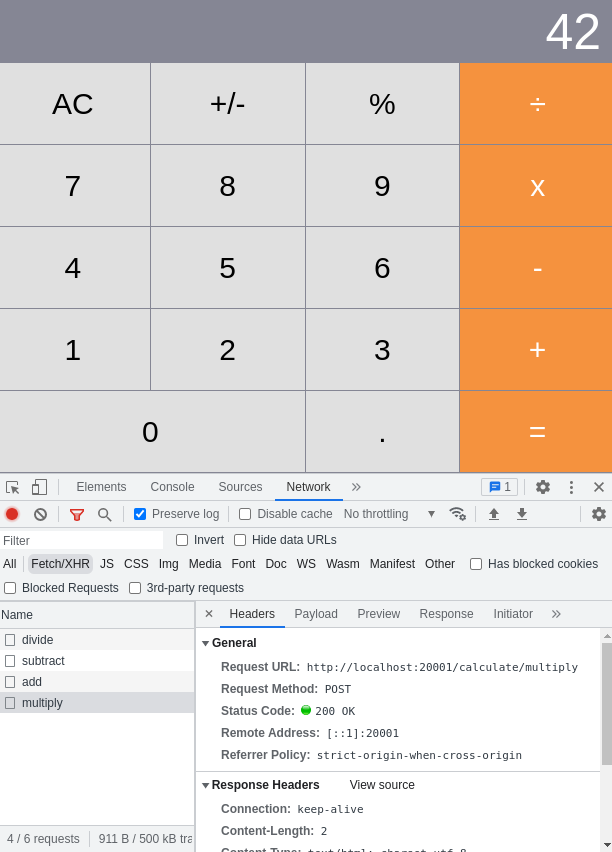

# Distributed calculator

This is a distributed calculator where each operation is powered by a different service written in a different language/framework.

Inspired from Dapr distributed calculator quickstart to explore various container development tools against a distributed application: https://github.com/dapr/quickstarts/tree/master/tutorials/distributed-calculator

Services and languages/frameworks:

- **Addition**: Go [mux](https://github.com/gorilla/mux) application
- **Multiplication**: Python [flask](https://flask.palletsprojects.com/en/2.2.x/) application
- **Division**: Node [Express](https://expressjs.com/) application
- **Subtraction**: [.NET Core](https://docs.microsoft.com/en-us/dotnet/core/) application

The front-end application consists of a server and a client written in [React](https://reactjs.org/).

